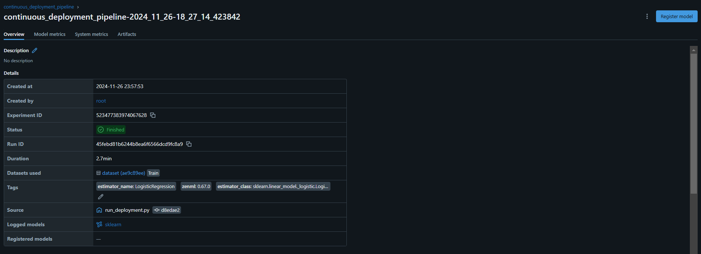
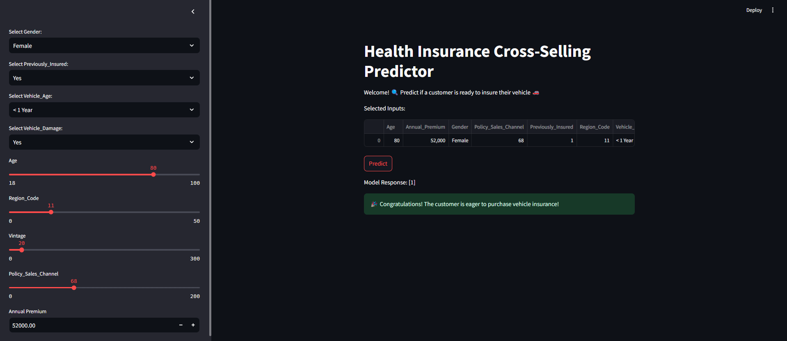
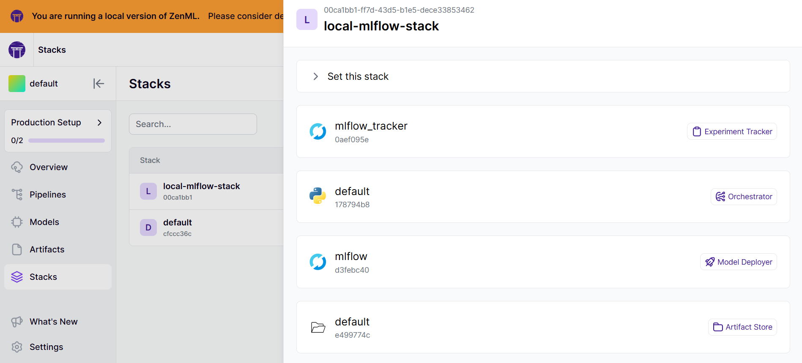

# Health Insurance Cross-Selling Prediction - MLops Project 

 

▶️YouTube 👉 [Explaination of the project](https://youtu.be/WOqLRJVPoEo?si=VPIYHEoKxoLsEuZZ)

## Project Overview 📋

Welcome to the Home Insurance Cross-Selling Prediction Project! This project is designed to identify customers holding home insurance who are likely to purchase additional vehicle insurance. By utilizing advanced machine learning techniques and integrating cutting-edge tools like MLflow, ZenML, and Streamlit, the project delivers a powerful and scalable solution for driving targeted marketing strategies and maximizing business impact.

We've crafted this project to seamlessly guide you through every step of the workflow—from data ingestion and cleaning to model training, deployment, and inference. With a focus on recall and scalability, the pipelines include robust quality checks, performance tracking, and automated deployment mechanisms.

This project empowers you with actionable insights and predictions, enabling businesses to optimize marketing efforts, enhance customer engagement, and boost revenue growth! 📊

## Objective 🎯

The primary goal is to develop a machine learning model that predicts customer interest in vehicle insurance based on:
- **Customer demographics** (age, gender, region).
- **Vehicle details** (vehicle age, damage history).
- **Policy information** (premium amount, sourcing channel).

The insights will enable targeted marketing campaigns and improve revenue forecasting. 

**Data Source:** The dataset for this project was sourced from [Kaggle](https://www.kaggle.com/competitions/playground-series-s4e7/data). 

## Pipelines ⚙

In this project, robust and scalable pipelines play a pivotal role in automating workflows for model training, evaluation, deployment, and inference. These pipelines ensure that every step—from raw data processing to model deployment—is streamlined, reproducible, and efficient. Leveraging tools like MLflow for tracking and automated workflows, the pipelines are designed to simplify the machine learning lifecycle, allowing for easy experimentation, monitoring, and continuous updates in production.


### 1. **Training Pipeline** 🚂


The training pipeline is an automated workflow designed to process raw data, train machine learning models, and log metrics. Below are the steps included in the pipeline:

- **Data Ingestion Step**: Extracts the dataset from the `.zip` file and loads the `train.csv` file for processing.

- **Data Cleaning Step**: Performs cleaning operations on the raw data, such as filling missing values and converting datatypes to ensure consistency.

- **Feature Engineering Step**: Applies various transformations to the features such as log transformation, encoding categorical features etc to enhance the dataset's predictive power.

- **Outlier Handling Step**: Detects and handles outliers in the dataset to improve model robustness.

- **Data Splitter Step**: Splits the dataset into training and testing subsets to prepare for model training and evaluation.

- **Resampling Step**: Treats imbalanced class distributions in the training data by applying resampling techniques.

- **Model Training Step**: Trains machine learning models using the processed training data and saves the trained models for deployment.

- **Model Evaluation Step**: Evaluates the model's performance using predefined metrics and logs the results, leveraging **MLflow autologging** to save metrics, artifacts, and parameters into the artifact store.

Below is the ROC AUC curve generated during the evaluation:


### 2. **Deployment Pipeline** 🚀

The deployment pipelines are designed to streamline the transition from model training to production, ensuring efficient deployment and seamless inference.

👉 **Continuous Deployment Pipeline** 🔄  

 

This pipeline automates the process of deploying the best-performing model to production. It ensures the entire workflow — from training to deployment — is optimized and scalable. Key features include:

- **Training Pipeline Integration**: Automatically integrates with the training pipeline to retrieve the latest trained model.  
- **Model Deployment**: Deploys the trained model using the **MLflow model deployer step**, with multiple workers to ensure scalability.  
- **Automatic Updates**: Monitors and redeploys models when needed, keeping the production environment up-to-date with the best-performing version.
 
👉 **Inference Pipeline** 🧠 


The inference pipeline is designed to generate predictions using the deployed model service. It enables real-time or batch predictions with new data. Key features include:

- **Dynamic Data Import**: Uses a `dynamic_importer` step to load new data from external sources, such as APIs.  
- **Model Service Loader**: Retrieves the deployed model service from **MLflow** to ensure predictions are based on the most recent deployment.  
- **Batch Inference**: Processes the input data through the `predictor` step, generating predictions quickly and efficiently.  

## Tech Stacks 🛠️     
### 👉 Experiment Tracking:
- **MLflow**:
  - Tracks experiments, metrics, parameters.
  - Facilitates model versioning and deployment.



### 👉 CI/CD Pipelines:
- **ZenML**:
  - Manages MLOps pipelines for seamless integration and automation.
  - Ensures efficient collaboration and model lifecycle management.

### 👉 User Interaction:
- **Streamlit**:
  - Provides an interactive web app for stakeholders to input data and receive predictions offering an intuitive user interface.


 
## Local Setup 👨🏼‍💻
1. **Clone the Repository**:
```bash
git clone https://github.com/kponna/Health-Insurance-Cross-Sell-Prediction-Mlops.git
cd Health-Insurance-Cross-Sell-Prediction-Mlops
```

2. **Set Up a Virtual Environment**:
```bash
# For macOS and Linux:
python3 -m venv venv

# For Windows:
python -m venv venv
```

3. **Activate the Virtual Environment**:
```bash
# For macOS and Linux:
source venv/bin/activate

# For Windows:
.\venv\Scripts\activate
```

4. **Install Required Dependencies**:
```bash
pip install -r requirements.txt
```

## Zenml Integration ⛩️
1. Install ZenML - https://docs.zenml.io/getting-started/installation 
```bash
pip install zenml["server"]
zenml init 
zenml up    
```

2. Mlflow integration:
```bash
zenml integration install mlflow -y
```

3. Register mlflow in the stack:
```bash   
zenml experiment-tracker register mlflow_tracker --flavor=mlflow
zenml model-deployer register mlflow --flavor=mlflow
zenml stack register local-mlflow-stack -a default -o default -d mlflow -e mlflow_tracker --set
zenml stack set  local-mlflow-stack # if not already set
```
  
### 👉 MLFlow for Model Deployer & Experiment Tracker with ZenML



# Running the Project 🏃

Follow these steps to run different components of the project:

1. **Training Pipeline**: 
   - To initiate the training pipeline, execute 

   ```bash
    python run_pipeline.py
    ```
2. **Continuous Integration Pipeline**:
   - To execute the CI/CD pipeline for continuous integration, run

   ```bash
   python run_deployment.py
   ```

3. **Streamlit Application**:
   - Start the Streamlit app to access the prediction interface using
   
    ```bash
   streamlit run streamlit_app.py
   ```  
 
### Acknowledgements 🙌
Special thanks to ZenML, MLflow, and Streamlit for making the MLops project development efficient and streamlined.

### Contact 📫
For any questions, suggestions, or collaboration opportunities, feel free to reach out:

📧Email: ponnakrishnaveni76@gmail.com 

🌐 LinkedIn: [Krishnaveni Ponna](www.linkedin.com/in/krishnaveni-ponna-28ab93239)

🐦 Twitter: [@Krishnaveni076](https://x.com/Krishnaveni076)
